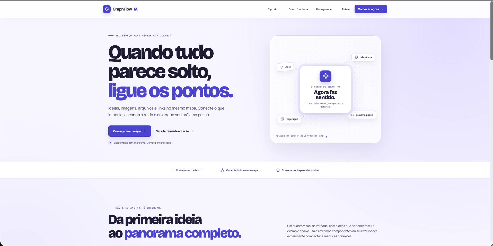
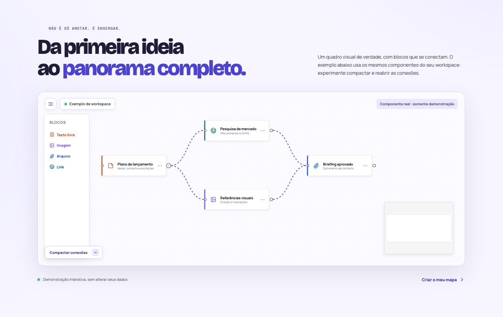
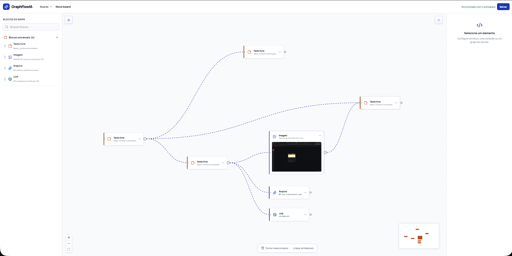
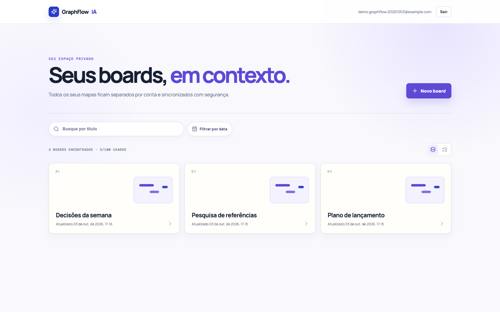
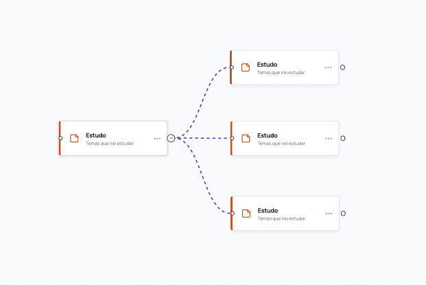
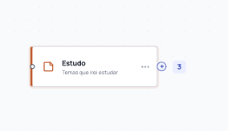

<div align="center">

# GraphFlow IA

### Quando tudo parece solto, ligue os pontos.

Um espaço visual e privado para transformar ideias, referências, arquivos e links em decisões com contexto.

[Começar localmente](#comece-localmente) · [Ver o produto](#o-produto-em-ação) · [O que existe hoje](#o-que-voce-encontra) · [Visão de IA](#visão-de-futuro-ia) · [Arquitetura](#arquitetura)

</div>



## A proposta

Pensamentos raramente chegam organizados. Uma nota depende de uma referência; uma imagem esclarece uma conversa; um documento muda uma decisão. O GraphFlow IA reúne essas peças em um canvas que mostra as relações — sem forçar o raciocínio a caber em uma lista.

Comece por uma ideia. Adicione contexto. Faça as conexões aparecerem.

> **Versão 1:** um whiteboard de organização e contexto. A IA é uma direção de produto futura — não há IA generativa, assistente ou automação inteligente operando nesta entrega.

| Hoje | Próximo capítulo |
| --- | --- |
| Capturar, conectar e enxergar contexto. | Usar IA como uma camada opcional para encontrar relações, resumir contexto e sugerir próximos passos. |

## O que você encontra

- Canvas visual com zoom, minimapa, arrastar e conectar cards.
- Quatro tipos de conteúdo: texto livre, imagem, arquivo e link — cada um com identidade visual própria.
- Imagens visíveis no próprio canvas, com prévia ampliável e área redimensionável.
- Anexos com upload seguro de até 50 MB; documentos, planilhas, mídia e imagens ficam próximos da decisão que apoiam.
- Ramificações compactáveis para reduzir ruído sem perder o caminho do pensamento.
- Biblioteca privada de boards com criação, renomeação, exclusão, busca por título, filtro por data, paginação e visualização em cards ou lista.
- Modo visitante para explorar o produto sem cadastro, mantendo os dados apenas no navegador.

## O produto em ação

Não é uma maquete estática: a demonstração da landing usa o mesmo componente de canvas do workspace. Ela apresenta uma ideia central, referências paralelas e um documento de saída no mesmo fluxo visual.



Quando o trabalho pede mais profundidade, o canvas aceita o conteúdo real: texto, imagem, arquivo e link conectados no mesmo mapa.



## Seu espaço, em contexto

Cada conta possui uma biblioteca isolada. Os exemplos abaixo foram criados no ambiente local da aplicação: três boards privados e um fluxo conectado com os quatro tipos de conteúdo.



## Foco quando o mapa cresce

Conexões não precisam virar ruído. Um card pode compactar a sua ramificação; os cards seguintes saem de cena sem que a relação seja perdida. Um clique reabre todo o contexto.

<table>
  <tr>
    <td width="50%"></td>
    <td width="50%"></td>
  </tr>
  <tr>
    <td align="center"><sub><b>Explorar</b> · todas as possibilidades visíveis</sub></td>
    <td align="center"><sub><b>Focar</b> · contexto preservado, ruído oculto</sub></td>
  </tr>
</table>

## Fluxo principal

```text
Criar ou abrir um board
        ↓
Adicionar uma ideia, imagem, arquivo ou link
        ↓
Conectar o que se relaciona
        ↓
Compactar o que não precisa estar em foco
        ↓
Decidir com mais contexto
```

## Visão de futuro: IA

A V1 resolve primeiro o fundamento: permitir que uma pessoa monte um mapa confiável, editável e privado dos próprios materiais. Só depois faz sentido adicionar inteligência.

O objetivo futuro não é colocar IA no centro do processo; é deixá-la trabalhar a favor do contexto que a pessoa construiu. As direções avaliadas incluem:

- sugerir conexões entre cards quando houver evidência suficiente;
- resumir uma ramificação sem apagar as fontes originais;
- destacar lacunas, dependências e possíveis próximos passos;
- transformar o mapa em ponto de partida para decisões, sem remover o controle humano.

Essas capacidades não fazem parte do escopo atual e não devem ser interpretadas como recursos já disponíveis.

## Comece localmente

### Pré-requisitos

- Node.js 20+
- .NET SDK 10
- Docker e Docker Compose

### 1. Suba o banco

```bash
docker compose up -d postgres
```

### 2. Inicie a API

Em outro terminal:

```bash
npm run api:dev
```

API disponível em `http://127.0.0.1:5275` e health check em `http://127.0.0.1:5275/health`.

### 3. Inicie o frontend

Em outro terminal:

```bash
npm install
npm run dev
```

Abra `http://localhost:5173`.

O frontend lê `VITE_API_URL` de `.env.development`. O valor padrão do repositório aponta para a API local em `http://localhost:5275`.

## Arquitetura

```text
┌─────────────────────────────┐
│ React + TypeScript + Vite    │
│ Canvas: @xyflow/react        │
└──────────────┬──────────────┘
               │ cookies HttpOnly + CSRF
┌──────────────▼──────────────┐
│ ASP.NET Core / .NET 10       │
│ autenticação + boards + API  │
└───────┬────────────────┬────┘
        │                │
┌───────▼───────┐ ┌──────▼─────────┐
│ PostgreSQL 17 │ │ Storage local   │
│ contas/boards │ │ anexos em dev   │
└───────────────┘ └────────────────┘
```

| Camada | Responsabilidade |
| --- | --- |
| Frontend | Experiência do canvas, biblioteca de boards e persistência local de contingência. |
| API | Autenticação, autorização por proprietário, validações, upload e persistência. |
| PostgreSQL | Contas, metadados dos boards, versões e metadados de anexos. |
| Storage | Conteúdo binário de anexos; volume local no desenvolvimento e no compose de produção. |

## Segurança e privacidade

Privacidade não é uma opção visual no produto. As proteções implementadas incluem:

- Sessão por cookie `HttpOnly`, com `SameSite=Lax`, expiração deslizante e política `Secure` fora do desenvolvimento.
- Escritas protegidas por token anti-CSRF.
- Senhas com mínimo de 12 caracteres, maiúscula, minúscula, número e símbolo.
- Rate limit no login e cadastro, além de bloqueio temporário após tentativas inválidas repetidas.
- E-mail e telefone únicos, com mensagens de validação claras.
- Todo board e anexo tem `OwnerId`; o servidor filtra leitura, alteração e download pelo proprietário. Um recurso de outra conta é tratado como inexistente.
- Upload limitado a 50 MB, tipo MIME normalizado pela extensão e checksum SHA-256 armazenado.

No modo visitante, dados ficam somente em `localStorage` e não são sincronizados nem enviados como backup. Para persistência privada e acesso em outros dispositivos, crie uma conta.

## Produção

O compose de produção executa web (Nginx), API .NET e PostgreSQL em serviços separados, com volumes persistentes para banco, anexos e chaves de proteção de dados.

```bash
POSTGRES_PASSWORD='uma-senha-forte' \
APP_ORIGIN='https://seu-dominio.com' \
docker compose -f docker-compose.production.yml up -d --build
```

Antes de expor a aplicação, configure HTTPS no proxy de borda e valide backup/restauração do PostgreSQL e do volume de anexos. O armazenamento de anexos desta entrega usa volume local; adotar object storage é uma decisão de infraestrutura futura, não uma dependência escondida.

## Verificação

```bash
npm run build
curl http://127.0.0.1:5275/health
```

O build valida TypeScript e a geração do bundle Vite. O health check confirma a disponibilidade da API.

## Estrutura do projeto

```text
.
├── src/                          # Interface React, canvas e estilos
├── backend/GraphFlow.Api/        # API .NET, Identity, EF Core e migrations
├── docs/images/                  # Capturas reais usadas nesta documentação
├── docker-compose.yml            # PostgreSQL para desenvolvimento
└── docker-compose.production.yml # Web, API, PostgreSQL e volumes persistentes
```

---

<div align="center">

**GraphFlow IA** · Ideias mais claras. Próximos passos mais visíveis.

</div>
